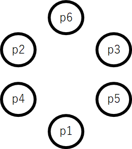

[問題へのLink (ABC173 [ProblemD])](https://atcoder.jp/contests/abc173/tasks/abc173_d)
### 費やした回答時間：約50分 ###
### Source Code ###
```
N = int(input())
A = list(map(int, input().split()))
A.sort(reverse=True)
if N % 2 == 0:
  print(A[0] + 2 * sum(A[1:int(N/2)]))
else:
  print(sum(A[:int((N+1)/2)]) + sum(A[1:int((N+1)/2)-1]))
```

### Idea ###
例として心地よさがそれぞれ1, 2, 3, 4, 5, 6である6人(p1, p2, p3, p4, p5, p6)がいたとする。  
はじめはp6を到着させ、その後、時計周りに順にp5,p4,...,p1を配置すれば良いと考えた(その場合はmin(6,4)+min(5,3)+min(4,2)+min(3,1)+min(2,6)となる)。  
しかし、最小値をとる際に差があるのがもったいなく感じた(当然min(6,4)<=min(6,5)が成り立つので)。  
そこで、以下のような貪欲的なstepを考えた。
- step1. p6を到着させる。
- step2. p5をp6の隣に到着させる。(p5の心地よさは6)
- step3. p4をp5とp6の隣に到着させる。(p4の心地よさはmin(5,6)=5)
- step4. p3をp5とp6の隣(A4とは別の位置)に到着させる。(p3の心地よさはmin(5,6)=5)
- step5. p2をp4とp6の隣に到着させる。(p2の心地よさはmin(4,6)=4)
- step6. p1をp4とp5の隣に到着させる。(p1の心地よさはmin(4,5)=4)  


以上より次の図のような配置が理想であると考えた。



また、仮にこれ以上心地よさが1のプレイヤーが続くとしても、A3の両端->A2の両端という順番で配置させていけば3,3,2,2がそれぞれ得られる(新たに加わったプレイヤーの心地よさは、その時点での両端のプレイヤーの心地よさよりも小さい)ので、以下のような足し算の、第1項から第(プレイヤーの数-1)項まで行えば良い。  
「プレイヤーの人数がN人であり、心地よさがそれぞれ降順で(A0,A1,...,AN-1)であるとすると、  
A0+A1+A1+A2+A2+A3+A3+...」  
仮にプレイヤー数Nが6なら、A0+A1+A1+A2+A2を計算すれば良い。
### Details ###
##### sample1 #####
```
4
2 2 1 3
```

1. 入力処理
```
N = int(input())
A = list(map(int, input().split()))

-----
N=4
A=[2, 2, 1, 3]
```
2. sort 

```
A.sort(reverse=True)

-----
A=[3, 2, 2, 1]
```

3. 計算 
Nが偶数、例えば6であれば、A[0]+A[1]+A[1]+A[2]+A[2]を行えばよく、print内の第1項がA[0]、第2項がA[1]+A[1]+A[2]+A[2] (=2*(A[1]+A[2]))に対応している。  
Nが奇数、例えば7であれば、A[0]+A[1]+A[1]+A[2]+A[2]+A[3]を行えばよく、print内の第1項がA[0]+A[1]+A[2]+A[3]、第2項がA[1]+A[2]に対応している。
```
if N % 2 == 0:
  print(A[0] + 2 * sum(A[1:int(N/2)]))
else:
  print(sum(A[:int((N+1)/2)]) + sum(A[1:int((N+1)/2)-1]))
```
### Impression ###
考えがまとまってから実装の完成までは5分もかからなかったが、不要な考え事に時間を多く費やしてしまった(貪欲法よりも最適な方法が本当にないかどうかとか)。  
実際に軽い例(N=6の場合など)で試して気づいたことを一般化できるセンス磨きたい。
